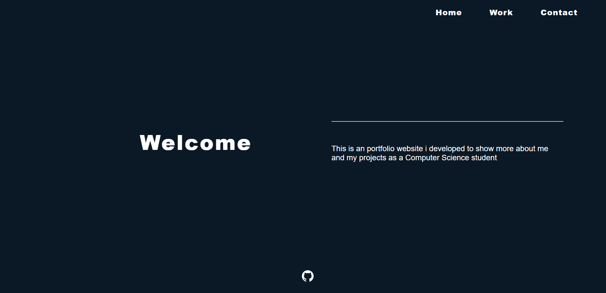
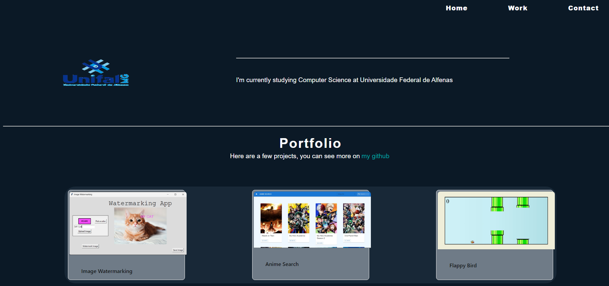
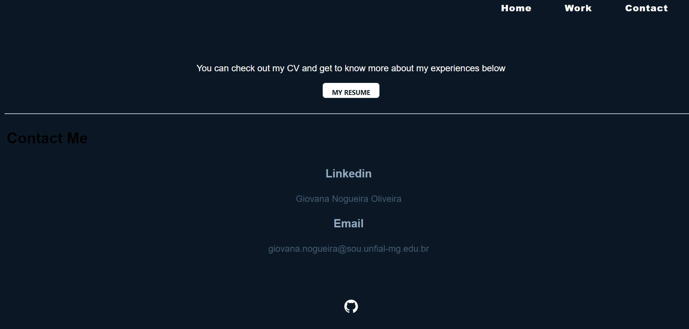

# React Portfolio

Welcome to my React portfolio, showcasing my projects and experiences as a Computer Science student.


---

## Pages


<div>
  
  
  
</div>


### Home

The home page provides a welcoming introduction, offering a brief overview of myself and the purpose of this portfolio.

### Work

On the projects page, you'll find a selection of my works, each accompanied by a brief description and a link to the corresponding GitHub repository.

### Contact

The contact page includes ways to get in touch with me, such as my LinkedIn profile and email address.

---
## How to Run

Ensure you have Node.js and npm installed. Run the following commands in the terminal:

```bash
# Install dependencies
npm install

# Start the React application
npm start

```
The app will be launched at http://localhost:3000
